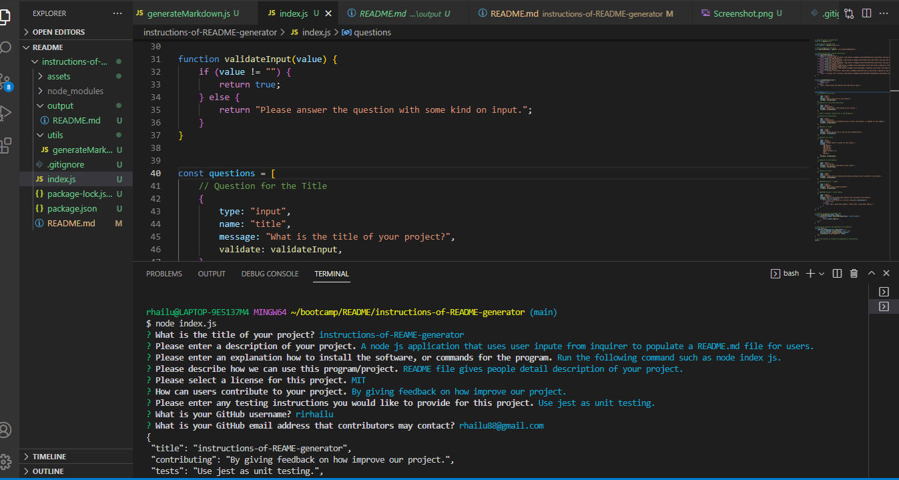

# instructions-of-README-generator

 

## Description

Your GitHub profile is an extremely important aspect of your public identity as a developer. This is a great way to take advantage of the opportunity to explain and showcase what your application purpose is. A well-developed README will help you stand out compared to other developers. This README generator was created using node js. With this README generator, you no longer need to create a professional README from scratch. Simply answer a few questions and watch as a README is automatically created.

## Installation

The instructions-of-README-generator was first created in repository in GitHub. The repository was cloned into local desktop. The update version of the software was uploaded. The index.js file was created and pushed into repository GitHub. Any changes made to local was added, committed, and pushed to repository.

## Credits

I would like to thank Ben Martin for assisting me with this project. 

https://www.youtube.com/watch?v=SpFyvDPdcO0&list=LL&index=1

https://vimeo.com/472128171 

## License

MIT License

Copyright (c) [] [ririhailu]

Permission is hereby granted, free of charge, to any person obtaining a copy
of this software and associated documentation files (the "Software"), to deal
in the Software without restriction, including without limitation the rights
to use, copy, modify, merge, publish, distribute, sublicense, and/or sell
copies of the Software, and to permit persons to whom the Software is
furnished to do so, subject to the following conditions:

The above copyright notice and this permission notice shall be included in all
copies or substantial portions of the Software.

THE SOFTWARE IS PROVIDED "AS IS", WITHOUT WARRANTY OF ANY KIND, EXPRESS OR
IMPLIED, INCLUDING BUT NOT LIMITED TO THE WARRANTIES OF MERCHANTABILITY,
FITNESS FOR A PARTICULAR PURPOSE AND NONINFRINGEMENT. IN NO EVENT SHALL THE
AUTHORS OR COPYRIGHT HOLDERS BE LIABLE FOR ANY CLAIM, DAMAGES OR OTHER
LIABILITY, WHETHER IN AN ACTION OF CONTRACT, TORT OR OTHERWISE, ARISING FROM,
OUT OF OR IN CONNECTION WITH THE SOFTWARE OR THE USE OR OTHER DEALINGS IN THE
SOFTWARE.

## Review  
* Video URL: https://drive.google.com/file/d/1YpqQSGIXTj8fg2oRenxHA6W184pClXrl/view

* https://github.com/ririhailu/Quiz-to-test-your-knowledge
  

